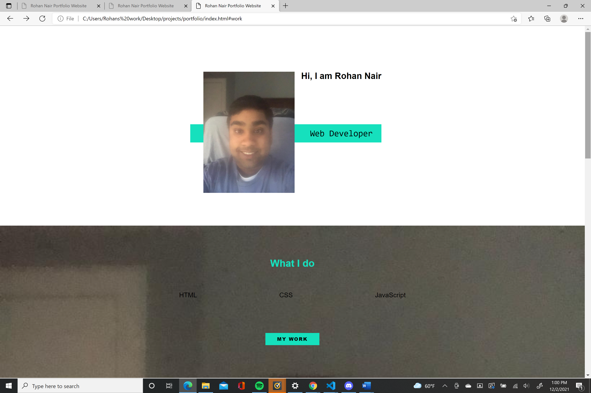
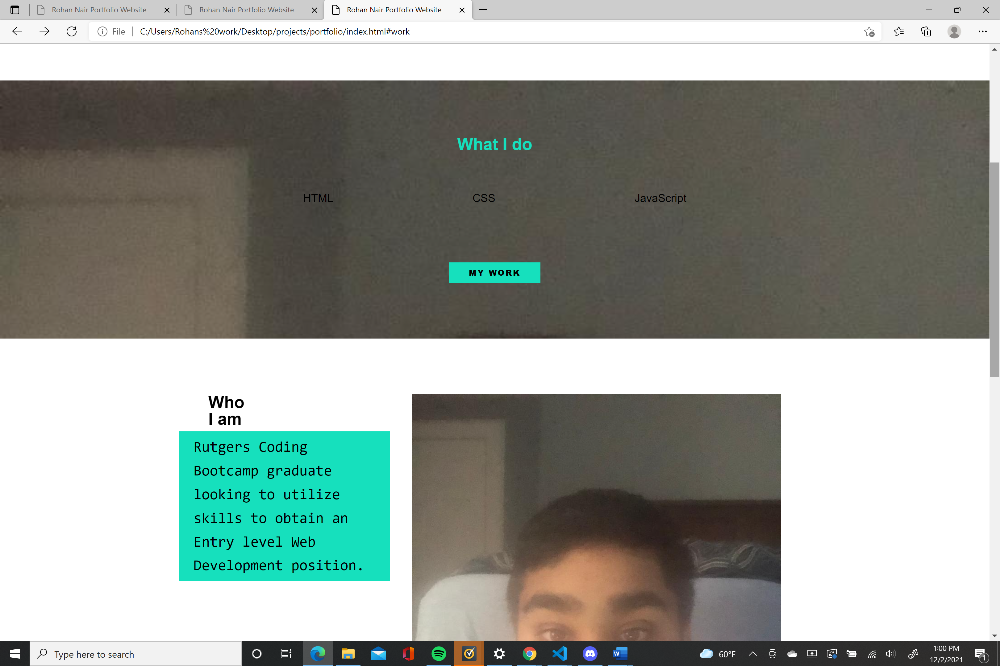
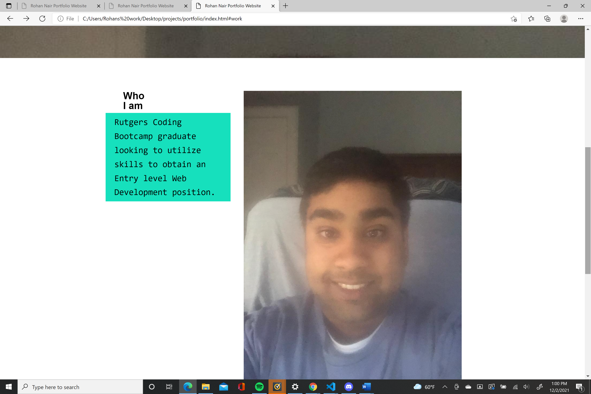
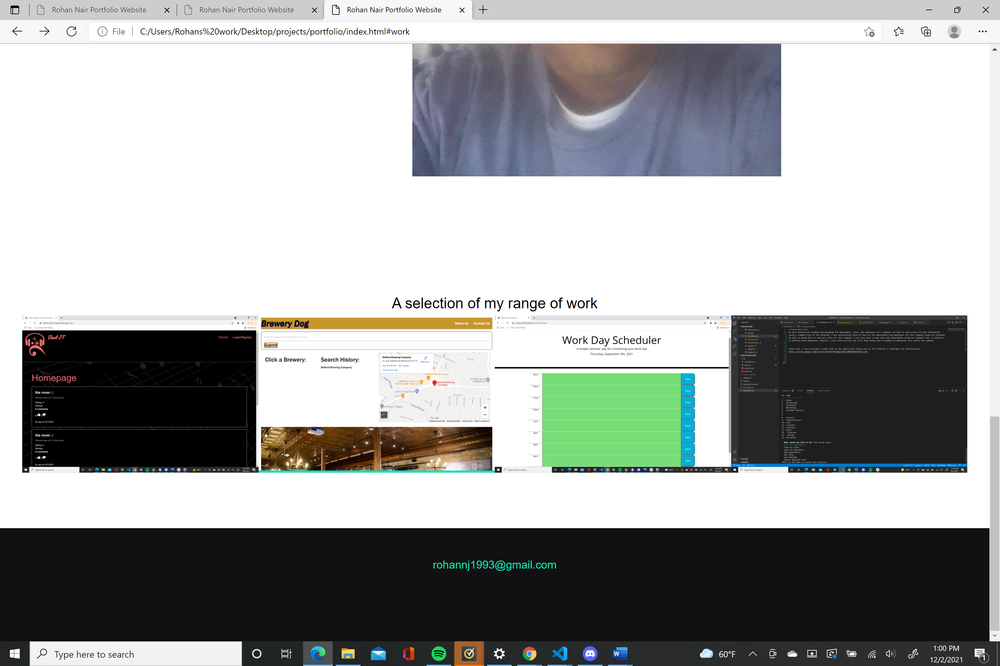

## Webdevportfolio- A portfolio that uses CSS, HTML and JavaScript to showcase my work to prospective employers.

## Deployed link- https://rohannj1993.github.io/Webdevportfolio/

## Success- Made portfolio page that is deployed to Github pages. Contains basic description of goal and links to projects

## Needs improvement- Need to work on CSS styling to change some images. Also needs to update profile picture with more professional headshot. Will Also need to make links on footer visible.

## Screenshots-
I also included some screenshots of the deployed page.

                      
  

